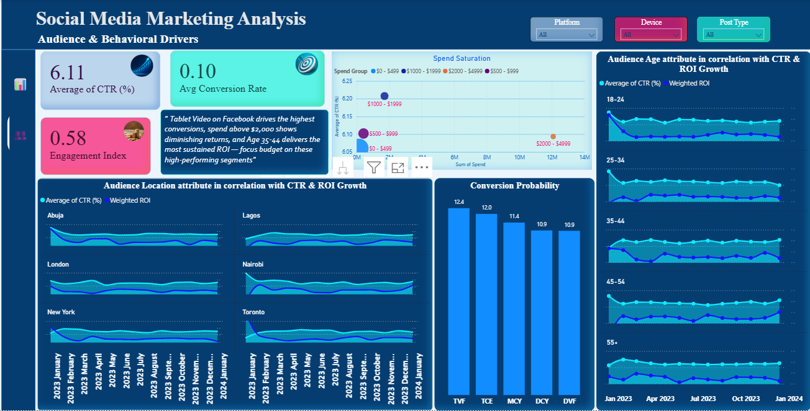
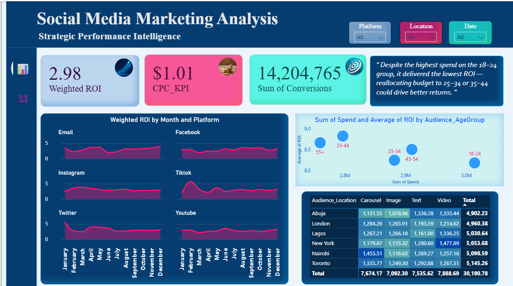

# Social-Media-Marketing-Campaign-Analytics

# Project Context
Businesses invest heavily in social media campaigns, but without structured analysis, it’s difficult to know which platforms, campaigns, or content types deliver the best ROI. Understanding engagement trends, audience behavior, and spend efficiency is critical for optimizing marketing strategies and driving revenue growth.

## Problem / Objective

- To identify where ad spend delivers the strongest and most consistent returns.
- To expose hidden conversion-cost inefficiencies across campaigns and regions.
- To ensure budget is directed toward the audiences that actually drive results.
- To uncover the audience–content combinations that maximize conversion potential.
- To detect when engagement drops as spending scales.
- To pinpoint the audience characteristics that sustain high CTR and ROI over time.

## Dataset Overview

This dataset contains over 6,000 social media campaign records across platforms like Facebook, Instagram, Twitter, and YouTube. It tracks campaign spend, impressions, clicks, conversions, revenue, and engagement metrics. The data reflects real-world inconsistencies, including duplicates, missing values, inconsistent naming, and spending outliers — making it a strong base for realistic analysis and decision-focused insights.

- 🔎 **Detailed Technical Notes**
    - **Size & Scope:** ~6,000+ records spanning multiple platforms
    - **Columns:**
        - **Identifiers & Meta:** Campaign_ID, Date, Platform, Device, Post_Type, Location
        - **Performance Metrics:** Spend, Impressions, Clicks, CTR, CPC, Conversions, Revenue
    - **Data Quality Issues:**
        - Duplicate campaign IDs across dates
        - Inconsistent casing (*facebook*, *Facebook*, *FB*)
        - Missing values in Spend, Conversions, and some engagement metrics
        - Outliers in Spend and Impressions (single-day spikes)

## Data Cleaning & Preparation Workflow

**1. Data Audit (Initial Review)**

- Checked for missing values in *Clicks*, *Spend*, and *Conversions* columns.
- Identified duplicate campaign entries (same *Campaign_ID* + *Date*).
- Found inconsistent casing in *Platform* (e.g., Instagram, IG , Email, email).

**2. Data Cleaning Steps**

- **Duplicates:** Removed exact duplicates; flagged near-duplicates for review.
- **Standardization:** Normalized text fields (*Platform*, *Device*, *Post_Type*) to consistent casing.
- **Missing Values:**
    - For *Clicks* , imputed with median by *Platform*.
    - For *Spend*, left nulls flagged as missing — important to track where data capture failed.
- **Date Formatting:** Converted *Date* column to proper datetime for time-series analysis.
- **Derived Metrics:** Created calculated columns such as:
    - ROI = (*Revenue – Spend*) ÷ *Spend*

**3. Final Checks**

- Verified column data types for Power BI compatibility.
- Ensured all *Campaign_IDs* and *Dates* align (no future dates or invalid IDs).
- Exported cleaned dataset to a staging table for Power BI analysis.

## Approach / Methods

### Power BI Dashboard

## Insights & Recommendations

- **Age 35–44 consistently delivers the strongest ROI**, suggesting this audience is the most reliable foundation for future scaling.
- **18–24 absorbs the highest spend yet returns the lowest ROI**, indicating the need to re-examine how much budget this group should continue to receive.
- **Campaigns above ~$2,000 show clear performance drops**, showing a natural spending threshold where efficiency begins to decline.
- **Facebook Tablet Video emerges as the most effective format–platform pairing**, pointing to an opportunity to lean more into this combination for high-conversion objectives.
- **Video content outperforms all other post types**, implying that video-first strategies may yield better engagement across multiple regions.
- **CTR is high in some regions but does not translate into ROI**, signaling that strong attention does not always equal quality audience intent.
- **Older audiences (45–54 and 55+) maintain stable CTR and ROI**, showing their potential as consistent long-term performers if given more focus.
